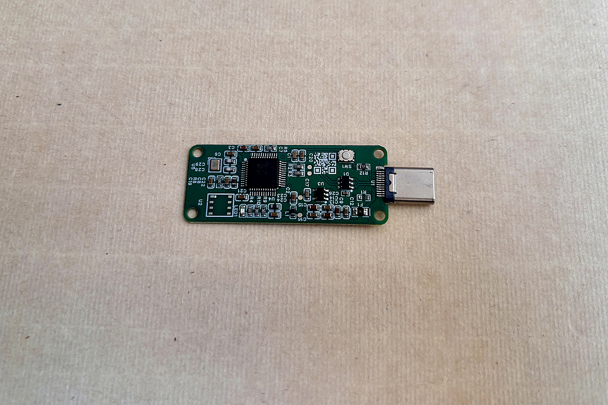

# QsQuantum USB TRNG & QRNG Hardware Entropy Source

Open‑source USB true random number generator (TRNG) and quantum random number generator (QRNG) with a physical entropy source. Cross‑platform support for Windows, macOS, and Linux.



## Features

- **True physical entropy source** — not pseudo‑random algorithm
- **Two product lines**: XuanZhen TRNG (true random) & XuanLiang QRNG (quantum random)
- **Two interface variants**: USB CDC (virtual serial port, driver‑free) and USB WinUSB (high‑performance)
- **Cross‑platform**: Windows 10/11, macOS, Linux
- **Open‑source host software**: Python scripts for reading random data and entropy testing
- **Randomness tested** per GM/T 0005‑2021 specification
- **Compact USB Type‑C form factor**

## Product Models

| Market Name | Model | Protocol | Description |
|---|---|---|---|
| XuanLiang C01 | QS‑QRNG‑C01 | USB CDC | Quantum RNG, driver‑free |
| XuanLiang W01 | QS‑QRNG‑W01 | USB WinUSB | Quantum RNG, requires libusb |
| XuanZhen C01 | QS‑TRNG‑C01 | USB CDC | True RNG, driver‑free |
| XuanZhen W01 | QS‑TRNG‑W01 | USB WinUSB | True RNG, requires libusb |

## Quick Start

### USB CDC Devices (C01)
```bash
# Install dependency
pip install pyserial

# Run
python rng_CDC.py

USB WinUSB Devices (W01)
Windows:
# Install WinUSB driver with Zadig, place libusb‑1.0.dll in the same folder
pip install pyusb libusb
python rng_WinUSB.py
macOS:
brew install libusb
pip3 install pyusb libusb
python3 rng_WinUSB.py
Linux:
sudo apt‑get install libusb‑1.0‑0‑dev
pip3 install pyusb libusb
python3 rng_WinUSB.py

Command‑Line Usage
# Read 100 MB
python rng_CDC.py -s 100M

# Read 1 GB with custom output file
python rng_CDC.py -s 1G -o myrand.bin

# Specify serial port (CDC only)
python rng_CDC.py -p COM3 -s 10M

Data is automatically saved to the `samples/` folder by default.

Performance
Protocol	Output Rate	Notes
USB CDC	~4.4–5.0 Mbps	USB Full‑Speed virtual serial port
USB WinUSB	Refer to model datasheet	Depends on physical entropy source

CDC stable throughput: approximately 550–625 KB/s.
Documentation
**[Download User Manual (PDF)](docs/XuanLiang_XuanZhen_RNG_User_Manual_EN.pdf)**
Purchase
🔗 **Available on Tindie** — https://www.tindie.com/products/43963/
🔗 **Available on Tindie** — https://www.tindie.com/products/43964/
## License

This project is open‑source. See LICENSE for details.
Disclaimer
Raw random output from hardware should be validated for entropy quality before deployment in security‑critical applications.
